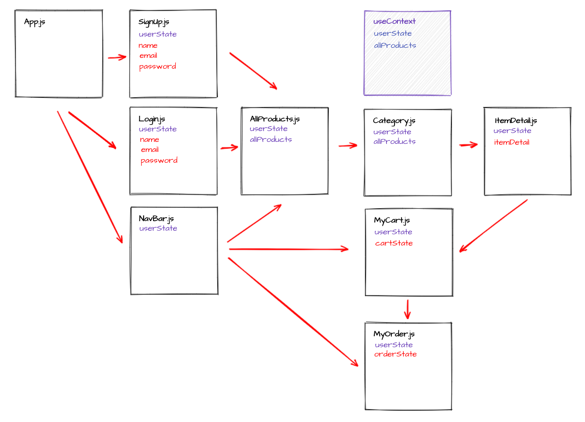

# Project-Three-Group

## Overview

This projects is about making an website that allows people to buy physical goods. The website would let the user register and login to their own account. Once login to their account, the user would be able to add and remove products from their cart. They are also able to see all of the products that is available to purchase. 

---

## Wireframe

---

## ERD

---

## Component Tree

---

## User Stories

:white_medium_small_square: User would create a account with the following name, email, and password.

:white_medium_small_square: User would login with their email and password. Then it would send to the user home page. 

:white_medium_small_square: User would be able to click on what category the user is interested in. 

:white_medium_small_square: Once the user find what they wanted. They are able to add the item to cart. 

:white_medium_small_square: Once done shopping, user is able to look into their cart. In there they could remove the item from the cart and then checkout. 

:white_medium_small_square: User is able to checkout their cart and there they would input their credit card and address. 

:white_medium_small_square: User is allow to check their recent orders.

---

## Routes 
| PATH | ROUTE | Description |
| --- | --- | --- |
| /user | POST | Signup/Create user |
| /user/login | POST | Login user |
| /user | GET | Verify user |
| /items | GET | Pull all products |
| /items/:id | GET | Pull product detail |
| /cart | POST | Add to cart |
| /cart | GET | Show my cart |
| /cart | DELETE | Remove from cart |

---

## Core Goals 

:one:&nbsp; When I first visit the site, I'm on a home page that just has a simple welcome message.

:two:&nbsp; When not logged in, I see links to home, signup & login only. If I were to visit any of these routes manually while logged in, I would get redirected to the home page.

:three:&nbsp; I can create an account, log in, and log out.

:four:&nbsp; When logged in, I see links to home, logout, All Products, My Cart, and My Orders. If I were to visit any of these routes manually while logged out, I would get redirected to the home page.

:five:&nbsp; The All Products page lists the names of all available products. Clicking on any product name takes me to its details page, which include a name, description, image, and price.

:six:&nbsp; The products are pre-seeded in the db. You are welcome to use one of the provided "seeders" files, or you may create your own. Examine the seeder file to understand what model you'll need to create (i.e. "product") and what attributes it will need (i.e. name, image, description, price, etc.).

:seven:&nbsp; In the Product Details page is an Add To Cart button, which saves the product in my cart. If I want to buy more than 1 of a product in an order, I can add it to my cart multiple times, and each one is displayed as a distinct product. (There's no way to buy in bulk.)

:eight:&nbsp; The My Cart page lists products that I have put into my cart. Next to each product is a Remove From Cart button, which removes the item from my cart (the item should disappear from the page without requiring a page refresh). The total of my order is displayed on the page (we're ignoring tax and shipping). There is a Checkout button which creates an order containing all the items from my cart, then empties the cart. In order to checkout, the shopper must input an address and a credit card number. These values will get saved to the order, but we won't do anything with them in this project. After checking out, the user is redirected to the My Orders page.

:nine:&nbsp; The My Orders page displays a list of my completed orders, using the date of the order as a clickable link. When I click on a single order, I see the Single Order page, which shows its products (name and price), the total price of the order, and the credit card & address.

---

## Strech Goals

:one:&nbsp; Each Product has a quantity in the database. When a user buys a product, its quantity is reduced. Products with a quantity of 0 are not displayed in the All Products page. (A user can still only buy 1 of a product at a time.)

:two:&nbsp; The app has one (or more) designated admin users. When an admin user logs in, they do not see the All Products, My Cart, and My Orders links. Instead, they see Manage Products and Orders To Fill.

:three:&nbsp; Manage Products MVP: The admin user sees a list of all products, and next to each one is an input to adjust the quantity of that product.

:four:&nbsp; Orders To Fill MVP: The admin user sees a list of all orders (from all users), which initially are in a Pending state. For each order, the admin user can click a button to convert it from Pending to Shipped. Shipped orders don't have a button, just a text or icon indicator that they've been shipped.

:five:&nbsp; Manage Products stretch: The admin user can add new products, and edit or delete existing ones.

:six:&nbsp; Implement userId encryption and password hashing (stretch goals from https://git.generalassemb.ly/SEIR-1011/express-user-authentication).

:seven:&nbsp; Deploy your app to Heroku. You'll need to make two separate deployments (frontend and backend).
